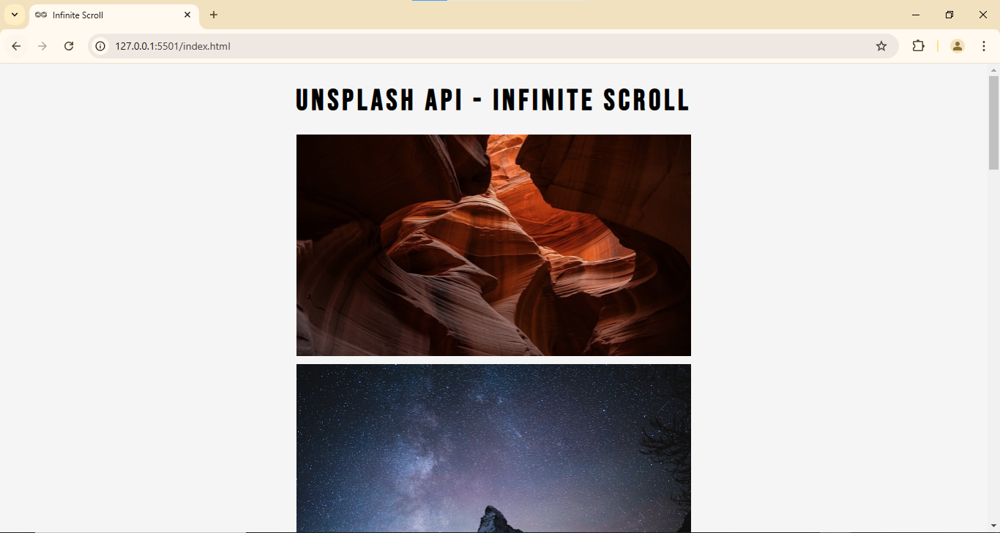

# Unsplash API - Infinite Scroll

This project demonstrates an **infinite scrolling web application** that dynamically loads images from the Unsplash API. The application seamlessly fetches and displays images as you scroll, creating an engaging and visually appealing user experience.

## Features

- **Infinite Scroll**: Automatically loads more images as the user scrolls down.
- **Unsplash Integration**: Utilizes the Unsplash API to fetch high-quality, random photos.
- **Responsive Design**: Works well on devices of all sizes with a clean, minimalistic design.
- **Loading Animation**: Displays a loader while fetching images to enhance user feedback.

## Demo

You can view the live version of the project hosted on **GitHub Pages**: [(https://neendudev.github.io/Infinity-Scroll/)].

## Project Structure

```plaintext
.
├── index.html      # Main HTML file
├── style.css       # Styles for the application
├── script.js       # JavaScript for API integration and infinite scrolling logic
├── loader.svg      # Loader animation
```

## How It Works

1. **Initial Load**: Fetches a limited number of images (5 by default) from Unsplash using its API.
2. **Dynamic Update**: Adjusts the API call to fetch more images (30 at a time) after the first batch.
3. **Scroll Detection**: Listens to user scroll events and triggers API calls when nearing the page's bottom.
4. **Image Loading Feedback**: Displays a loader until all images are fully rendered.

## Technologies Used

- **HTML5**: Structure of the application.
- **CSS3**: Styling and responsiveness.
- **JavaScript (ES6+)**: Logic for API calls, DOM manipulation, and event handling.
- **Unsplash API**: Source of high-quality, random images.

## Setup and Usage

1. Clone the repository:
   ```bash
   git clone https://github.com/your-username/your-repo-name.git
   ```
2. Navigate to the project directory:
   ```bash
   cd your-repo-name
   ```
3. Open `index.html` in your browser to view the application.

> **Note**: The API key is directly embedded in the `script.js` file for simplicity since GitHub Pages doesn't support server-side operations. For production environments, consider securing the API key using a server-side setup.

## Screenshots



## Future Improvements

- **Environment Variables**: Implement a secure method to store the API key.
- **Enhanced Error Handling**: Add feedback for API errors or network issues.
- **Custom Filters**: Allow users to apply filters (e.g., categories, keywords) to fetch specific images.

## License

This project is licensed under the [MIT License](LICENSE).

## Acknowledgments

- Special thanks to [Unsplash](https://unsplash.com/) for providing an amazing collection of images.
- Inspired by infinite scrolling applications.

---

Feel free to contribute or share feedback by opening an issue or submitting a pull request!


Let me know if you'd like to refine any section or include additional details!

